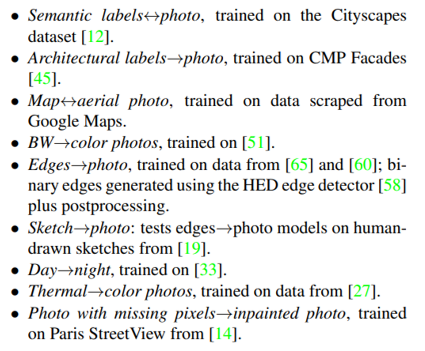

# PIX2PIX

* ###  Image-to-Image Translation with Conditional Adversarial Networks

  * 이미지의 Style을 변화시키는 Image-to-Image translation, 즉 Style transfer를 제안함

    

* ### 등장 배경

  * 기존의 GAN은 random noise를 input으로 받기 때문에 무작위 데이터를 생성하게 됨. 따라서 실생활에 적용하기 어려움

  * 이전에 있었던 Colorization task를 포함하여 보다 다양한 Domain에 GAN을 적용하고자 함

    

* ### Training

  

  * CGAN의 구조를 차용하여 이미지 생성에 condition x를 사용하는데, 이때 x는 변환하고자 하는 input image

  * 학습을 진행하면 G는 이미지 y와 비슷한 도메인을 가진 이미지를 생성하도록 학습됨

    

  * 이때 학습되는 프로세스는 edge를 물체로 변환하거나, colorization, 낮과 밤을 바꾸는 등 매우 다양한 프로세스가 가능함

    

* ### Loss Function

  

  

  * 두 이미지의 차이를 계산할 때 가장 단순한 방법은 각 픽셀의 차이를 더하는 방법 (like L1 loss)

    

    

    

  * 그러나 전체 픽셀의 관점으로 최적화를 진행하면 모델이 이미지를 대충 뭉뚱그리게 되며, 흐릿해지는 현상이 발생함. 이러한 Blurring은 VAE에서도 나타나는 고질적인 문제로, 모델이 loss의 최소값을 위해 픽셀을 평균값으로 채워버리는 현상

  * 따라서 단독으로 사용하기 어려운 L1 loss를 GAN loss와 함께 사용하는 방법을 제안. D의 목적 함수에는 차이가 없지만, G는 추가로 output과 target image의 거리를 좁히게 됨

    * cGAN loss
  
      
    
    * L1 loss
    
      
    
    * 두 식을 더해 objective function을 만듦
    
      
    
  * 기존에 cGAN은 모델이 deterministic 해지는것을 방지하기 위해 Gaussian noise로 output을 제어했는데 pix2pix network에선 노이즈가 무시되고 학습되는 경향이 있음. 따라서 training time, test time 모두 dropout을 사용하는 것으로 대체함
  
  

* ### Architecture

  

  * Pix2Pix2는 Input Output 모두 이미지이기 때문에 Size가 줄어들었다가 늘어나는 encoder-decoder 구조를 띔. 이때 차원 축소로 인한 정보 손실을 최소화하기 위해 skip connection을 추가하는데 이를 U-Net이라고 함
  * D의 경우,  단일 이미지에서 Patch 단위로 판별하고 평균을 구함. Patch의 크기는 hyperparameter인데, 작을수록 파라미터가 줄어들어 학습이 빨라짐

* ### Experiment

  * 범용성을 목적으로 둔 만큼 굉장히 다양한 실험을 함

    

    

  * L1 loss와 skip connection 유무에 따른 결과물 차이

    

    

  * Patch Size에 따른 생성물 차이. 클수록 결과물도 좋지만 본 논문에서는 70x70이 적정 사이즈라고 말함

    

    

  * Image Colorization. Colorization task는 본인들의 이전 논문인 colorful image colorization(2번째)가 더 잘 된것을 볼 수 있음. 특히 3번째 줄은 mode failure이 발생해 grayscale 이미지가 생성됨. pix2pix는 보다 다양한 domain에 적용하기 위한 범용성이 목표이기 때문에 단일 task를 목표로 하는 논문에 비교하면 뒤쳐지는 경우가 있음

    